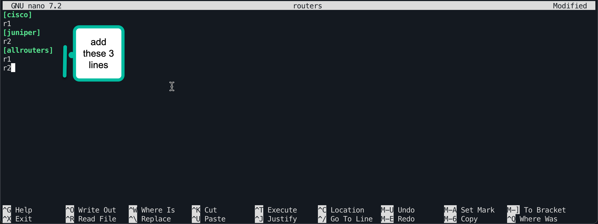

# Lab 1 – Ansible command line

## The Ansible Command
From the command line of your Ansible server you can run the “ansible” command to perform simple tasks. For larger tasks, involving multiple changes or devices, an Ansible playbook is used. Playbooks are discussed in more detail in the Lab 3.

## Ansible facts
Ansible uses a system of data gathering commands to automatically gather information about the device being managed. Examples of the data gathered:
- Interface IP addresses
- Hostname
- Version of software
## Task 1 – Gathering facts for a Cisco device 
Make sure you are in the lab1 directory, and your shell prompt starts with “(Lab)”. Issue the “pwd” command to confirm your present working directory.
```yaml
(Lab) ➜  lab1 pwd
/home/student1/labs/lab1
```

The commands you will run have been recorded into text files so that you can copy and paste them. 
```yaml
(Lab) ➜  lab1 ls
ansible.cfg  inventory  task1.txt  task2.txt  task3.txt
```

To view the command for the first task, use the “cat \<filename\>” command.
```yaml
(Lab) ➜  lab1 cat task1.txt
ansible cisco -m cisco.ios.ios_facts
(Lab) ➜  lab1
```

Try the command from task1 yourself.
```yaml
(Lab) ➜  lab1 ansible cisco -m cisco.ios.ios_facts
r1 | SUCCESS => {
    "ansible_facts": {
        "ansible_net_api": "cliconf",
        "ansible_net_gather_network_resources": [],
        "ansible_net_gather_subset": [
            "default"
        ],
        "ansible_net_hostname": "csr1",
        "ansible_net_image": "bootflash:packages.conf",
        "ansible_net_iostype": "IOS-XE",
        "ansible_net_model": "CSR1000V",
        "ansible_net_operatingmode": "autonomous",
        "ansible_net_python_version": "3.11.6",
        "ansible_net_serialnum": "9BNAC028QW1",
        "ansible_net_system": "ios",
        "ansible_net_version": "17.03.01a",
        "ansible_network_resources": {}
    },
    "changed": false
}
(Lab) ➜  lab1
```

Ansible has gathered basic facts about the configuration of r1, our Cisco router.  The facts are displayed in a data format called Javascript Object Notation (JSON). 

 In JSON, variables are recorded as key, value pairs.  For example, “variable_name”: “variable_value”.  This creates a simple variable that holds a string of text. 

Look at the output of the command you ran. On the 8th line of output, there is a variable named "ansible_net_hostname”.  Then looking to the right of the :, the value of this variable is “csr1”.

Facts can be used to make decisions within Ansible, and for populating data in reports.
### Question
What version of IOS is router r1 running?

Look for the ansible_net_version variable.
```yaml
"ansible_net_version": "17.03.01a",

```

## Task 2 – Gathering facts from a Juniper device
Cat the file “task2.txt” to see how to gather facts from a Juniper device. Run the command.

```yaml
(Lab) ➜  lab1 cat task2.txt
ansible juniper -m junipernetworks.junos.junos_facts
(Lab) ➜  lab1 ansible juniper -m junipernetworks.junos.junos_facts
r2 | SUCCESS => {
    "ansible_facts": {
        "ansible_net_api": "netconf",
        "ansible_net_gather_network_resources": [],
        "ansible_net_gather_subset": [
            "default"
        ],
        "ansible_net_hostname": "vmx1",
        "ansible_net_model": "vmx",
        "ansible_net_python_version": "3.11.6",
        "ansible_net_serialnum": "VM65311E62C8",
        "ansible_net_system": "junos",
        "ansible_net_version": "18.2R1.9",
        "ansible_network_resources": {}
    },
    "changed": false
}
(Lab) ➜  lab1
```

This output should look very similar to the output from the Cisco device. One of the strengths of Ansible is that differences between manufacturers can be abstracted away. 

For example, wether its a Juniper or Cisco device, the hostname is always captured in the fact “ansible_net_hostname”.

## The Ansible command line
So far, you have run two different commands for gathering facts from a Juniper or Cisco device. In later labs you will see how to write a single task that works with both manufacturers automatically.

Before looking at the final task for this lab, let’s look at the structure of the ansible command itself.

```yaml
ansible juniper -m junipernetworks.junos.junos_facts
```

How did ansible know what devices to run that command against? The first argument to the ansible command is the host or group name to apply the command to.  In this case, the command is targeting the “juniper” group.

Looking at the second part of the command:
```yaml
-m junipernetworks.junos.junos_facts
```
This tells Ansible which module you want to use. In Ansible, a module is a component that performs an action on the device. There are many modules provided with Ansible, or as part of the community contributed collections known as Ansible Galaxy. At this point, most common IT equipment has an Ansible module available for management. 

Where do host or group names come from? Ansible uses an inventory system to configure the hosts and groups that Ansible will work with. Inventory can take the form of simple text files similar to a Windows INI file, YAML files, or be dynamically generated by running a program.


The inventory for each lab is stored in the inventory directory. Try using the cat command on “inventory/routers” to see the inventory for this lab.

```yaml
(Lab) ➜  lab1 cat inventory/routers
[cisco]
r1
[juniper]
r2
(Lab) ➜  lab1
```

Lines that have a name surrounded with square brackets (‘[‘ and ‘]’) start a new group. The members of that group are listed afterwards, one member for line. So the router, r1, is a member of group cisco, and the router r2 is a member of group juniper.

Nodes, or hosts, can be members of multiple groups.
## Task 3 – Add a new inventory group
Before we add a new group to the inventory, it is helpful to learn a new command, ansible-inventory.

The ansible-inventory command outputs the inventory in JSON format. This is helpful for troubleshooting and could also be used to interface with other programs.

```yaml
(Lab) ➜  lab1 ansible-inventory --list
{
    "_meta": {
        "hostvars": {
            "r1": {
                "ansible_connection": "ansible.netcommon.network_cli",
                "ansible_host": "172.20.20.10",
                "ansible_network_os": "cisco.ios.ios",
                "ansible_password": "admin",
                "ansible_user": "admin"
            },
            "r2": {
                "ansible_connection": "ansible.netcommon.netconf",
                "ansible_host": "172.20.20.11",
                "ansible_network_os": "junipernetworks.junos.junos",
                "ansible_password": "admin@123",
                "ansible_user": "admin"
            }
        }
    },
    "all": {
        "children": [
            "ungrouped",
            "cisco",
            "juniper"
        ]
    },
    "cisco": {
        "hosts": [
            "r1"
        ]
    },
    "juniper": {
        "hosts": [
            "r2"
        ]
    }
}
(Lab) ➜  lab1
```

Look at the “meta” section at the beginning of the ansible-inventory output. This includes all the inventory information for how ansible will contact each host. In a later lab, you will see where this configuration is stored. Ansible typically connects to network devices over ssh. For Junos it uses netconf over ssh, and for IOS it is a traditional ssh session.

Edit the file inventory/routers with nano. Add the 3 lines shown in the screenshot below and save the file.


Now run the ansible-inventory command to verify your change.
```yaml
(Lab) ➜  lab1 ansible-inventory --list
{
    "_meta": {
        "hostvars": {
            "r1": {
                "ansible_connection": "ansible.netcommon.network_cli",
                "ansible_host": "172.20.20.10",
                "ansible_network_os": "cisco.ios.ios",
                "ansible_password": "admin",
                "ansible_user": "admin"
            },
            "r2": {
                "ansible_connection": "ansible.netcommon.netconf",
                "ansible_host": "172.20.20.11",
                "ansible_network_os": "junipernetworks.junos.junos",
                "ansible_password": "admin@123",
                "ansible_user": "admin"
            }
        }
    },
    "all": {
        "children": [
            "ungrouped",
            "cisco",
            "juniper",
            "allrouters"
        ]
    },
    "allrouters": {
        "hosts": [
            "r1",
            "r2"
        ]
    },
    "cisco": {
        "hosts": [
            "r1"
        ]
    },
    "juniper": {
        "hosts": [
            "r2"
        ]
    }
}
(Lab) ➜  lab1
```

There are a few interesting things to notice in this output. First, the allrouters group has been created and has members r1, and r2. 

Looking above the allrouters group in the output we see the group “all”. This group is predefined by ansible and will always include all hosts regardless of type. There is also a group called ungrouped, any nodes defined in the inventory before the first group are automatically added to this group.

## Task 4 – gathering more facts.
The facts that are being gathered are useful, but there is a lot of detail we would like to see that is missing. By default, the facts gathered are limited to basic parameters. This task will show you all the facts that are available for Cisco IOS and Juniper Junos. 

```yaml
(Lab) ➜  lab1 cat task4.txt
ansible juniper -m junipernetworks.junos.junos_facts -a gather_subset=all,\!hardware
ansible cisco -m cisco.ios.ios_facts -a gather_subset=all
(Lab) ➜  lab1
```

Before running these commands, look at what was added to the command line. 
```yaml
-a gather_subset=all,\!hardware
-a gather_subset=all
```

The “-a” argument tells Ansible that what follows is an argument to the module being invoked. In the case of the Juniper device, we want to gather all available facts but excluding facts under the hardware category. The VMX router used in this lab does not support the hardware category, only physical devices support that category. The “!” means negation for Ansible, so this says not hardware. The “\\” is necessary to tell the Unix shell to treat the “!” as a normal character.

Try one or both of the one-liners in this task.
```
(Lab) ➜  lab1 ansible juniper -m junipernetworks.junos.junos_facts -a gather_subset=all,\!hardware
r2 | SUCCESS => {
    "ansible_facts": {
        "ansible_net_api": "netconf",
        "ansible_net_config": "## Last changed: 2023-10-19 12:17:32 UTC\nversion 18.2R1.9;\nsystem {\n    login {\n        user admin {\n            uid 2000;\n            class super-user;\n            authentication {\n                encrypted-password \"$6$kROaItFW$7DxteQ.7ySpjQBT1xm9EZg8j5avd/qlaguFg0PQKkHbqtOodvNP95uGdMvMSCEd6SvPCy.RUqiBzalYI3aH3W1\";\n            }\n        }\n    }\n    root-authentication {\n        encrypted-password \"$6$qKj1CL8T$0gUJa6QxFloi76qPLpPaW0IfIg0e1JDoCYmifkfDsWo45MMUlz1esU1z5mLpUNtNfBBDfp6owRO9v6e.XEOvo1\";\n    }\n    host-name vmx1;\n    management-instance;\n    services {\n        ssh;\n        extension-service {\n            request-response {\n                grpc {\n                    clear-text {\n                        port 57400;\n                    }\n                    max-connections 4;\n                }\n            }\n        }\n        netconf {\n            ssh;\n            rfc-compliant;\n        }\n    }\n    syslog {\n        user * {\n            any emergency;\n        }\n        file messages {\n            any notice;\n            authorization info;\n        }\n        file interactive-commands {\n            interactive-commands any;\n        }\n    }\n}\nchassis {\n    fpc 0 {\n        pic 0 {\n            number-of-ports 96;\n        }\n    }\n}\ninterfaces {\n    fxp0 {\n        unit 0 {\n            family inet {\n                address 10.0.0.15/24;\n            }\n        }\n    }\n}\nrouting-instances {\n    mgmt_junos {\n        description management-instance;\n        routing-options {\n            static {\n                route 0.0.0.0/0 next-hop 10.0.0.2;\n            }\n        }\n    }\n}",
        "ansible_net_gather_network_resources": [],
        "ansible_net_gather_subset": [
            "config",
            "interfaces",
            "default"
        ],
        "ansible_net_hostname": "vmx1",
        "ansible_net_interfaces": {
            ".local.": {
                "admin-status": "up",
                "macaddress": "Unspecified",
                "mtu": "Unlimited",
                "oper-status": "up",
                "speed": "Unlimited",
                "type": "Loopback"
            },
            "cbp0": {
                "admin-status": "up",
                "macaddress": "2c:6b:f5:ab:b6:11",
                "mtu": "9192",
                "oper-status": "up",
                "speed": "Unspecified",
                "type": "Ethernet"
            },
            "demux0": {
                "admin-status": "up",
                "macaddress": "Unspecified",
                "mtu": "9192",
                "oper-status": "up",
                "speed": "Unspecified",
                "type": "Software-Pseudo"
            },
            "dsc": {
                "admin-status": "up",
                "macaddress": "Unspecified",
                "mtu": "Unlimited",
                "oper-status": "up",
                "speed": "Unspecified",
                "type": "Software-Pseudo"
            },
            "em1": {
                "admin-status": "up",
                "macaddress": "0c:00:b5:a1:fd:01",
                "mtu": "1514",
                "oper-status": "up",
                "speed": "1000mbps",
                "type": "Ethernet"
            },
            "esi": {
                "admin-status": "up",
                "macaddress": "Unspecified",
                "mtu": "Unlimited",
                "oper-status": "up",
                "speed": "Unlimited",
                "type": "Software-Pseudo"
            },
            "fti0": {
                "admin-status": "up",
                "macaddress": "Unspecified",
                "mtu": "Unlimited",
                "oper-status": "up",
                "speed": "Unlimited",
                "type": "FTI"
            },
            "fti1": {
                "admin-status": "up",
                "macaddress": "Unspecified",
                "mtu": "Unlimited",
                "oper-status": "up",
                "speed": "Unlimited",
                "type": "FTI"
            },
            "fxp0": {
                "admin-status": "up",
                "macaddress": "0c:00:75:68:29:00",
                "mtu": "1514",
                "oper-status": "up",
                "speed": "1000mbps",
                "type": "Ethernet"
            },
            "ge-0/0/0": {
                "admin-status": "up",
                "macaddress": "0c:00:37:37:6a:01",
                "mtu": "1514",
                "oper-status": "up",
                "speed": "1000mbps",
                "type": null
            },
            "ge-0/0/1": {
                "admin-status": "up",
                "macaddress": "0c:00:a4:c3:86:02",
                "mtu": "1514",
                "oper-status": "up",
                "speed": "1000mbps",
                "type": null
            },
            "ge-0/0/2": {
                "admin-status": "up",
                "macaddress": "2c:6b:f5:ab:b6:02",
                "mtu": "1514",
                "oper-status": "down",
                "speed": "1000mbps",
                "type": null
            },
            "ge-0/0/3": {
                "admin-status": "up",
                "macaddress": "2c:6b:f5:ab:b6:03",
                "mtu": "1514",
                "oper-status": "down",
                "speed": "1000mbps",
                "type": null
            },
            "gre": {
                "admin-status": "up",
                "macaddress": null,
                "mtu": "Unlimited",
                "oper-status": "up",
                "speed": "Unlimited",
                "type": "GRE"
            },
            "ipip": {
                "admin-status": "up",
                "macaddress": null,
                "mtu": "Unlimited",
                "oper-status": "up",
                "speed": "Unlimited",
                "type": "IPIP"
            },
            "irb": {
                "admin-status": "up",
                "macaddress": "2c:6b:f5:ab:bd:f0",
                "mtu": "1514",
                "oper-status": "up",
                "speed": "Unspecified",
                "type": "Ethernet"
            },
            "jsrv": {
                "admin-status": "up",
                "macaddress": "00:00:00:00:00:00",
                "mtu": "1514",
                "oper-status": "up",
                "speed": "Unspecified",
                "type": "Ethernet"
            },
            "lc-0/0/0": {
                "admin-status": "up",
                "macaddress": "Unspecified",
                "mtu": "0",
                "oper-status": "up",
                "speed": "800mbps",
                "type": "Unspecified"
            },
            "lo0": {
                "admin-status": "up",
                "macaddress": "Unspecified",
                "mtu": "Unlimited",
                "oper-status": "up",
                "speed": "Unspecified",
                "type": "Loopback"
            },
            "lsi": {
                "admin-status": "up",
                "macaddress": "Unspecified",
                "mtu": "Unlimited",
                "oper-status": "up",
                "speed": "Unlimited",
                "type": "Software-Pseudo"
            },
            "mtun": {
                "admin-status": "up",
                "macaddress": null,
                "mtu": "Unlimited",
                "oper-status": "up",
                "speed": "Unlimited",
                "type": "Multicast-GRE"
            },
            "pfe-0/0/0": {
                "admin-status": "up",
                "macaddress": "Unspecified",
                "mtu": "0",
                "oper-status": "up",
                "speed": "800mbps",
                "type": "Unspecified"
            },
            "pfh-0/0/0": {
                "admin-status": "up",
                "macaddress": "Unspecified",
                "mtu": "0",
                "oper-status": "up",
                "speed": "800mbps",
                "type": "Unspecified"
            },
            "pimd": {
                "admin-status": "up",
                "macaddress": null,
                "mtu": "Unlimited",
                "oper-status": "up",
                "speed": "Unlimited",
                "type": "PIMD"
            },
            "pime": {
                "admin-status": "up",
                "macaddress": null,
                "mtu": "Unlimited",
                "oper-status": "up",
                "speed": "Unlimited",
                "type": "PIME"
            },
            "pip0": {
                "admin-status": "up",
                "macaddress": "2c:6b:f5:ab:bd:b0",
                "mtu": "9192",
                "oper-status": "up",
                "speed": "Unspecified",
                "type": "Ethernet"
            },
            "pp0": {
                "admin-status": "up",
                "macaddress": "Unspecified",
                "mtu": "1532",
                "oper-status": "up",
                "speed": "Unspecified",
                "type": "PPPoE"
            },
            "rbeb": {
                "admin-status": "up",
                "macaddress": "Unspecified",
                "mtu": "Unlimited",
                "oper-status": "up",
                "speed": "Unlimited",
                "type": "Software-Pseudo"
            },
            "tap": {
                "admin-status": "up",
                "macaddress": "Unspecified",
                "mtu": "Unlimited",
                "oper-status": "up",
                "speed": "Unlimited",
                "type": "Software-Pseudo"
            },
            "vtep": {
                "admin-status": "up",
                "macaddress": "Unspecified",
                "mtu": "Unlimited",
                "oper-status": "up",
                "speed": "Unlimited",
                "type": "Software-Pseudo"
            }
        },
        "ansible_net_model": "vmx",
        "ansible_net_python_version": "3.11.6",
        "ansible_net_serialnum": "VM65311E62C8",
        "ansible_net_system": "junos",
        "ansible_net_version": "18.2R1.9",
        "ansible_network_resources": {}
    },
    "changed": false
}
(Lab) ➜  lab1
```
The output for the Junos device facts has been truncated here. The output you’ll receive in the lab is much longer because all possible interfaces are present. In this lab, only interfaces ge-0/0/0 through ge-0/0/4 are actually present on the virtual machine.

Below is the output for r1, the Cisco device.
```
(Lab) ➜  lab1 ansible cisco -m cisco.ios.ios_facts -a gather_subset=all
r1 | SUCCESS => {
    "ansible_facts": {
        "ansible_net_all_ipv4_addresses": [
            "10.0.0.15"
        ],
        "ansible_net_all_ipv6_addresses": [],
        "ansible_net_api": "cliconf",
        "ansible_net_config": "Building configuration...\n\nCurrent configuration : 6066 bytes\n!\n! Last configuration change at 12:17:34 UTC Thu Oct 19 2023\n!\nversion 17.3\nservice timestamps debug datetime msec\nservice timestamps log datetime msec\n! Call-home is enabled by Smart-Licensing.\nservice call-home\nplatform qfp utilization monitor load 80\nplatform punt-keepalive disable-kernel-core\nplatform console serial\n!\nhostname csr1\n!\nboot-start-marker\nboot-end-marker\n!\n!\n!\nno aaa new-model\n!\n!\n!\n!\n!\n!\n!\nip domain name example.com\n!\n!\n!\nlogin on-success log\n!\n!\n!\n!\n!\n!\n!\nsubscriber templating\n! \n! \n! \n! \n!\n!\nmultilink bundle-name authenticated\n!\n!\n!\n!\n!\n!\n!\n!\n!\n!\n!\n!\n!\n!\n!\ncrypto pki trustpoint TP-self-signed-3177340814\n enrollment selfsigned\n subject-name cn=IOS-Self-Signed-Certificate-3177340814\n revocation-check none\n rsakeypair TP-self-signed-3177340814\n!\ncrypto pki trustpoint SLA-TrustPoint\n enrollment pkcs12\n revocation-check crl\n!\n!\ncrypto pki certificate chain TP-self-signed-3177340814\n certificate self-signed 01\n  30820330 30820218 A0030201 02020101 300D0609 2A864886 F70D0101 05050030 \n  31312F30 2D060355 04031326 494F532D 53656C66 2D536967 6E65642D 43657274 \n  69666963 6174652D 33313737 33343038 3134301E 170D3233 31303139 31323137 \n  34335A17 0D333331 30313831 32313734 335A3031 312F302D 06035504 03132649 \n  4F532D53 656C662D 5369676E 65642D43 65727469 66696361 74652D33 31373733 \n  34303831 34308201 22300D06 092A8648 86F70D01 01010500 0382010F 00308201 \n  0A028201 0100BD94 8ED680EF 711EE836 E0467793 0D81D0AB 4C8180CA 8B6E3C8C \n  39E9D984 444DF681 BACC1527 2E3E6EB0 A8CEDC3B 897C2DA1 6F8692C1 701D4894 \n  8C9932E2 AEF2329E 25D0669E 4CC7F126 A9146373 E86018BF F7A38558 B3D219AE \n  372BCCC6 D6D7E127 47C88613 3C4B7FCC 90A13BD1 92623DA9 C1D77ED5 5FF29062 \n  9A2A3961 DDF8865F A96FFC73 23BA7E0F F5ECCD9B E24BE747 1D726F12 3B5C811B \n  4B4F5746 3D1490A7 6B9544A1 A9424255 AFC59704 ED41243E 313AF194 BC5FE502 \n  D7816561 3C43E37A 91F88D95 6DE9C7B3 5ACFCB25 1B3D1ABE DEACEBBA E12B404B \n  D6FD2D96 B0A36F52 BA13E409 6D10BC8A 2D6C3DCF 61281A49 84D1576B D84B3CD1 \n  93A6FF4E 96D50203 010001A3 53305130 0F060355 1D130101 FF040530 030101FF \n  301F0603 551D2304 18301680 145E9FDA 7180F443 64444774 F4FBCC4F 8A065684 \n  9F301D06 03551D0E 04160414 5E9FDA71 80F44364 444774F4 FBCC4F8A 0656849F \n  300D0609 2A864886 F70D0101 05050003 82010100 2D5AEA9A 0EBD51D2 FB018177 \n  DF7E7D8B 68F18839 63D91B85 EC697604 64402BB0 C55DC765 9182A6B2 EF47F727 \n  C38D3316 F4B6A0BD 9EEED3A1 D8C5BCD1 4F35985F A2EE94FC 1A98924A 7495B599 \n  AEEAD0C2 675C263C 13011D01 E6FC0214 30CDA9BF 5D20F9DD CA36CCB0 0557BAE9 \n  E200A4DD 4D1122BB D140658A 0B50A389 E97D2B5D 634FE00F 7193F418 31C13062 \n  E1CA48EB 1AEE1B8F B23BEB00 1E074A5C 291083C4 CACCBB86 4AAA6E49 242B64DB \n  C3043CA3 FF237731 52FBD58B 958125ED 620A6A74 5A007FC4 C7EE8033 9CC9BD6E \n  B805476C 88D68495 1DF4692E 6D7A2609 49096F18 EB0F8884 D376EC8C CB8B9638 \n  205988B1 815DE8BC 5F2C8B75 2B91F61A 8D8B72CC\n  \tquit\ncrypto pki certificate chain SLA-TrustPoint\n certificate ca 01\n  30820321 30820209 A0030201 02020101 300D0609 2A864886 F70D0101 0B050030 \n  32310E30 0C060355 040A1305 43697363 6F312030 1E060355 04031317 43697363 \n  6F204C69 63656E73 696E6720 526F6F74 20434130 1E170D31 33303533 30313934 \n  3834375A 170D3338 30353330 31393438 34375A30 32310E30 0C060355 040A1305 \n  43697363 6F312030 1E060355 04031317 43697363 6F204C69 63656E73 696E6720 \n  526F6F74 20434130 82012230 0D06092A 864886F7 0D010101 05000382 010F0030 \n  82010A02 82010100 A6BCBD96 131E05F7 145EA72C 2CD686E6 17222EA1 F1EFF64D \n  CBB4C798 212AA147 C655D8D7 9471380D 8711441E 1AAF071A 9CAE6388 8A38E520 \n  1C394D78 462EF239 C659F715 B98C0A59 5BBB5CBD 0CFEBEA3 700A8BF7 D8F256EE \n  4AA4E80D DB6FD1C9 60B1FD18 FFC69C96 6FA68957 A2617DE7 104FDC5F EA2956AC \n  7390A3EB 2B5436AD C847A2C5 DAB553EB 69A9A535 58E9F3E3 C0BD23CF 58BD7188 \n  68E69491 20F320E7 948E71D7 AE3BCC84 F10684C7 4BC8E00F 539BA42B 42C68BB7 \n  C7479096 B4CB2D62 EA2F505D C7B062A4 6811D95B E8250FC4 5D5D5FB8 8F27D191 \n  C55F0D76 61F9A4CD 3D992327 A8BB03BD 4E6D7069 7CBADF8B DF5F4368 95135E44 \n  DFC7C6CF 04DD7FD1 02030100 01A34230 40300E06 03551D0F 0101FF04 04030201 \n  06300F06 03551D13 0101FF04 05300301 01FF301D 0603551D 0E041604 1449DC85 \n  4B3D31E5 1B3E6A17 606AF333 3D3B4C73 E8300D06 092A8648 86F70D01 010B0500 \n  03820101 00507F24 D3932A66 86025D9F E838AE5C 6D4DF6B0 49631C78 240DA905 \n  604EDCDE FF4FED2B 77FC460E CD636FDB DD44681E 3A5673AB 9093D3B1 6C9E3D8B \n  D98987BF E40CBD9E 1AECA0C2 2189BB5C 8FA85686 CD98B646 5575B146 8DFC66A8 \n  467A3DF4 4D565700 6ADF0F0D CF835015 3C04FF7C 21E878AC 11BA9CD2 55A9232C \n  7CA7B7E6 C1AF74F6 152E99B7 B1FCF9BB E973DE7F 5BDDEB86 C71E3B49 1765308B \n  5FB0DA06 B92AFE7F 494E8A9E 07B85737 F3A58BE1 1A48A229 C37C1E69 39F08678 \n  80DDCD16 D6BACECA EEBC7CF9 8428787B 35202CDC 60E4616A B623CDBD 230E3AFB \n  418616A9 4093E049 4D10AB75 27E86F73 932E35B5 8862FDAE 0275156F 719BB2F0 \n  D697DF7F 28\n  \tquit\n!\nlicense udi pid CSR1000V sn 9BNAC028QW1\ndiagnostic bootup level minimal\nmemory free low-watermark processor 71556\n!\n!\nspanning-tree extend system-id\n!\nusername admin privilege 15 password 0 admin\n!\nredundancy\n!\n!\n!\n!\n!\n!\n!\n! \n!\n!\n!\n!\n!\n!\n!\n!\n!\n!\n!\n!\n!\n! \n! \n!\n!\ninterface GigabitEthernet1\n ip address 10.0.0.15 255.255.255.0\n negotiation auto\n no mop enabled\n no mop sysid\n!\ninterface GigabitEthernet2\n no ip address\n shutdown\n negotiation auto\n no mop enabled\n no mop sysid\n!\ninterface GigabitEthernet3\n no ip address\n shutdown\n negotiation auto\n no mop enabled\n no mop sysid\n!\nip forward-protocol nd\nno ip http server\nip http secure-server\n!\n!\n!\n!\n!\n!\n!\n!\ncontrol-plane\n!\n!\n!\n!\n!\n!\nline con 0\n stopbits 1\nline vty 0\n login local\n transport input all\nline vty 1\n login local\n length 0\n transport input all\nline vty 2 4\n login local\n transport input all\n!\ncall-home\n ! If contact email address in call-home is configured as sch-smart-licensing@cisco.com\n ! the email address configured in Cisco Smart License Portal will be used as contact email address to send SCH notifications.\n contact-email-addr sch-smart-licensing@cisco.com\n profile \"CiscoTAC-1\"\n  active\n  destination transport-method http\n!\n!\n!\n!\n!\nnetconf-yang\nrestconf\nend",
        "ansible_net_filesystems": [
            "bootflash:"
        ],
        "ansible_net_filesystems_info": {
            "bootflash:": {
                "spacefree_kb": 5307696.0,
                "spacetotal_kb": 6139200.0
            }
        },
        "ansible_net_gather_network_resources": [],
        "ansible_net_gather_subset": [
            "hardware",
            "config",
            "default",
            "interfaces"
        ],
        "ansible_net_hostname": "csr1",
        "ansible_net_image": "bootflash:packages.conf",
        "ansible_net_interfaces": {
            "GigabitEthernet1": {
                "bandwidth": 1000000,
                "description": null,
                "duplex": "Full",
                "ipv4": [
                    {
                        "address": "10.0.0.15",
                        "subnet": "24"
                    }
                ],
                "lineprotocol": "up",
                "macaddress": "0c00.3a37.9700",
                "mediatype": "Virtual",
                "mtu": 1500,
                "operstatus": "up",
                "type": "CSR vNIC"
            },
            "GigabitEthernet2": {
                "bandwidth": 1000000,
                "description": null,
                "duplex": "Full",
                "ipv4": [],
                "lineprotocol": "down",
                "macaddress": "0c00.dfb1.c701",
                "mediatype": "Virtual",
                "mtu": 1500,
                "operstatus": "administratively down",
                "type": "CSR vNIC"
            },
            "GigabitEthernet3": {
                "bandwidth": 1000000,
                "description": null,
                "duplex": "Full",
                "ipv4": [],
                "lineprotocol": "down",
                "macaddress": "0c00.806e.5702",
                "mediatype": "Virtual",
                "mtu": 1500,
                "operstatus": "administratively down",
                "type": "CSR vNIC"
            }
        },
        "ansible_net_iostype": "IOS-XE",
        "ansible_net_memfree_mb": 458.6839714050293,
        "ansible_net_memtotal_mb": 698.7988090515137,
        "ansible_net_model": "CSR1000V",
        "ansible_net_neighbors": {},
        "ansible_net_operatingmode": "autonomous",
        "ansible_net_python_version": "3.11.6",
        "ansible_net_serialnum": "9BNAC028QW1",
        "ansible_net_system": "ios",
        "ansible_net_version": "17.03.01a",
        "ansible_network_resources": {}
    },
    "changed": false
}
(Lab) ➜  lab1
```

## Summary
In this lab, you looked at two commands:
- ansible
- ansible-inventory
You should be able to use these commands to verify changes to your inventory, and gather facts from IOS and Junos network devices. You also started learning about JSON.