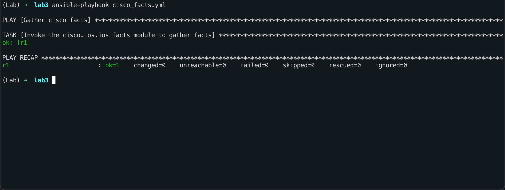
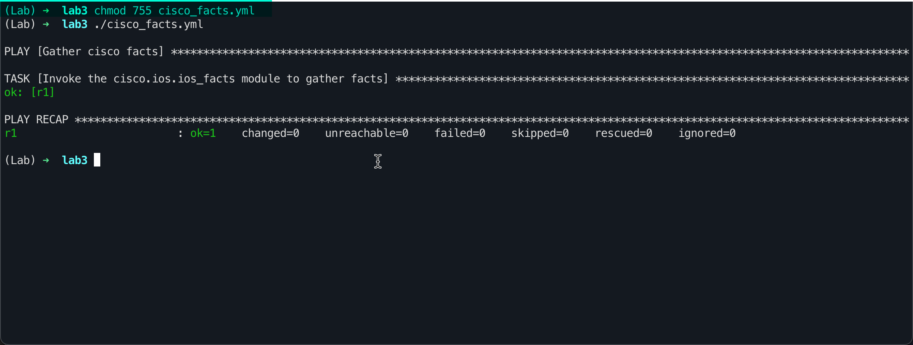
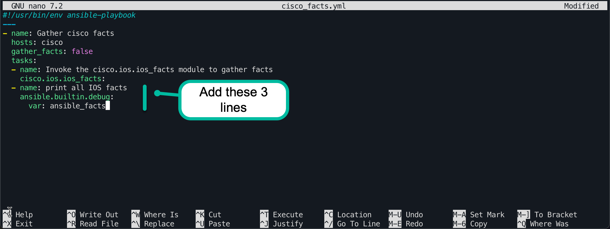
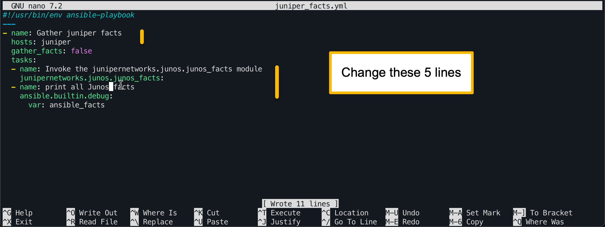
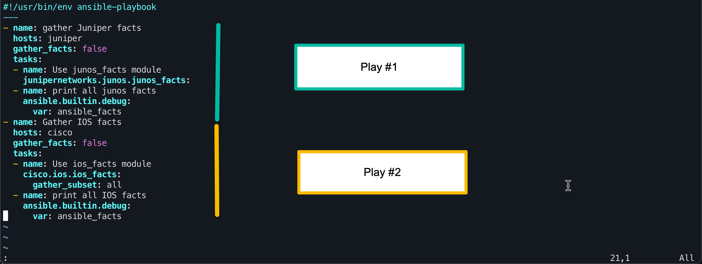

# Lab 3 — Ansible Playbooks

## Ansible Playbooks
In Lab 1 you used one-liners to gather facts from the labs Cisco and Juniper devices. In Lab 2 you learned more about JSON and YAML. 

In this lab you will create a playbook to gather facts from a device, and output those facts to the screen with the debug module. You will also learn about the “when” clause to execute tasks only when certain conditions are true.

## Structure of a playbook
Playbooks are Ansible’s way for specifying the actions or state required for a given set of hosts. Playbooks are broken down into a set of plays, each play performs a set of tasks on the hosts specified for that play.

The format for a playbook is shown in the YAML document below.
```yaml
---
- name: Play 1
  hosts: Hosts or groups for play 1
  gather_facts: True 
  tasks:
  - name: Task 1 for Play 1
    module_name:
      module_option_1: value
      module_option_2: value
  - name: Task 2 for Play 1
    module_name:
      module_option_1: value
- name: Play 2
  hosts: Hosts or groups for play 2
  gather_facts: False
  tasks:
  - name: Task 1 for Play 2
    module_name:
      module_option_1: value
  - name: Task 2 for Play 2
    module_name: 
      module_option_1: value
```

Each play can have a different set of hosts that it works on.  You can have lists of hosts or groups and logic to combine groups or hosts.
```yaml
---
- name: Examples 1 all hosts group
  hosts: all
  ...
- name: Example 2 all hosts but exclude r2
  hosts: all,!r2
  ...
- name: Example 3 multiple hosts or groups
  hosts: cisco:juniper
  ...
- name: Example 4 hosts in two groups simultaneously 
  hosts: cisco:&denver
- name: Example 5 all hosts whose name starts with switch
  hosts: switch*
  ...
- name: Example 6 all hosts named switch 1 through 7
  hosts: switch[1:7]
```

Look at the examples above. The plays are truncated to highlight the hosts portion of the definition. Multiple hosts or groups can be listed. They are separated by either a colon ‘:’ or a comma ‘,’. 

In Example 2 the all hosts builtin group is selected. Then host r2 is excluded by saying “!r2”. Remember that ‘!’ means not in Ansible. 

In Example 3 two groups are selection, cisco and juniper. Any host that belongs to the group cisco *OR* the group juniper will be included. 

In Example 4 the opposite logic is employed. The ampersand ‘&’ character means logical and. So any host that belongs to the group cisco *AND* the group Denver will be selected for this play. 

Examples 5 and 6 demonstrate using simple regular expressions to pick multiple hosts or groups at once. The asterisks ‘\*’ character means match anything. So switch\* will match any host or group whose name begins with switch. The [1:7] means match the range of values 1 through 7. Any host or group whose name starts with the word switch followed by a number 1 through 7 will match. It must be exactly in that format, “switch-7” will not match because the hyphen character was not included in the expression.

You can create arbitrary long selectors for the hosts. For example
```yaml
---
- name: Long host selector example
  hosts: cisco:&denver:!r7
```
This example targets all hosts in group cisco that also belong to group Denver, except host r7.

For more details on host selection, see the Ansible documentation linked below.

[Ansible host selection documentation](https://docs.ansible.com/ansible/latest/inventory_guide/intro_patterns.html "Host selection and patterns")

### Disabling fact gathering
The process of gathering facts can be time consuming. On a typical router it might take Ansible 3-5 seconds to gather all of the facts for that device. On a play that targets many devices this can result in very slow playbook runs. You can disable fact gathering when you aren’t using facts for a given play. 

```yaml
---
- name: A play without fact gathering
  hosts: all
  gather_facts: false
  tasks:
  - name: Task 1
    module_name:
      module_option: value
  
```

The default value is for gather\_facts is True.

For each play you must include a list of tasks. There is no limit on the number of tasks you include, there must be at least one. Each task can use exactly one module.

## Task 1 — Gathering Cisco facts in a playbook
For your first playbook, we will revisit the facts gathering from Lab 1. 

In this playbook, you will use the cisco.ios.ios\_facts module to gather facts from the cisco group of routers.

Make sure you are in the lab3 directory.
```yaml
(Lab) ➜  lab3 pwd
/home/student1/labs/lab3
(Lab) ➜  lab3
```

Create the file cisco\_facts.yml with your preferred editor in the lab3 directory. The text you need to enter is available in the task1.txt file.

```yaml
(Lab) ➜  lab3 cat task1.txt
Open cisco_facts.yml in your editor.

nano cisco_facts.yml

Add the basic playbook structure to the top of the file.

---
- name: Gather cisco facts
  hosts: cisco
  gather_facts: false
  tasks:
  - name: Invoke the cisco.ios.ios_facts module to gather facts
    cisco.ios.ios_facts:
```

Now that you’ve created the cisco\_facts.yml playbook, you need to run it. Playbooks are run using the ansible-playbook command. 
```yaml
ansible-playbook <playbook-file-name>
```

Run your playbook now, your output should be similar to that shown below.

Looking at the screenshot above you should recognize the text you entered for the name of the Play and the name of the Task.

Under each task, you will see the status for each host that task executed on.
```yaml
TASK [Invoke the cisco.ios.ios_facts module to gather facts] ***********************************************************
ok: [r1]
```

In this case, only r1 is in the group cisco.

The play recap reports the overall status of the play. If anything was changed on a host, you will see changed=X where X is the number of hosts that changes were made to. Similarly, any hosts that had failures will be counted under failures=X. 
```yaml
PLAY RECAP **********************************************************
r1                         : ok=1    changed=0    unreachable=0    failed=0    skipped=0    rescued=0    ignored=0
```
Play results are color coded. Green means success, Red means failure, and Orange means something was changed. 

### Making playbooks into executable files
It is often convenient to make your playbooks into executable files that you can run directly instead of typing the ansible-playbook command.  The procedure for this is two steps long.
- Add “#!/usr/bin/env ansible-playbook” as the first line of the file.
- Set the permissions of the file to be executable “chmod 755 file\_name”
- Run the playbook with “./playbook-file-name”


Our playbook ran successfully, but what information did it actually gather? 

## Task 2 — Using the debug module to print out a variable at runtime
Ansible’s debug module can be very useful for printing out values while a playbook is executing. The debug module will be invoked as a second task within our play.

You can cat task2.txt in the lab environment to see what lines of text to add to your playbook. After you’ve added the new task, run your playbook again.



How does this new task work?
The module being invoked is “ansible.builtin.debug”. This module takes one argument, “var: name-of-variable-to-display”, the key “var”. The value for this key is the name of the variable to be printed. Here selecting “ansible\_facts” will cause all of the gathered ansible facts to be printed.

The output from your playbook run should be similar to that shown below:
```yaml
(Lab) ➜  lab3 ./cisco_facts.yml

PLAY [Gather cisco facts] *******************************************************************************************************************

TASK [Invoke the cisco.ios.ios_facts module to gather facts] ********************************************************************************
ok: [r1]

TASK [print all IOS facts] ******************************************************************************************************************
ok: [r1] => {
    "ansible_facts": {
        "net_api": "cliconf",
        "net_gather_network_resources": [],
        "net_gather_subset": [
            "default"
        ],
        "net_hostname": "csr1",
        "net_image": "bootflash:packages.conf",
        "net_iostype": "IOS-XE",
        "net_model": "CSR1000V",
        "net_operatingmode": "autonomous",
        "net_python_version": "3.11.6",
        "net_serialnum": "9BNAC028QW1",
        "net_system": "ios",
        "net_version": "17.03.01a",
        "network_resources": {}
    }
}

PLAY RECAP **********************************************************************************************************************************
r1                         : ok=2    changed=0    unreachable=0    failed=0    skipped=0    rescued=0    ignored=0

(Lab) ➜  lab3
```

## Task 3 — Juniper facts playbook

In this task you will create a new playbook with the same functionality as cisco\_facts.yml, but aimed at Juniper devices.

First copy cisco\_facts.yml to juniper\_facts.yml
```yaml
(Lab) ➜  lab3 cp cisco_facts.yml juniper_facts.yml
(Lab) ➜  lab3
```

You can find the changes you need to make by using the cat command with task3.txt



When you run the new playbook you should see output similar to this:
```yaml
(Lab) ➜  lab3 chmod 755 juniper_facts.yml
(Lab) ➜  lab3 ./juniper_facts.yml

PLAY [Gather juniper facts] *****************************************************************************************************************

TASK [Invoke the junipernetworks.junos.junos_facts module] **********************************************************************************
ok: [r2]

TASK [print all Junos facts] ****************************************************************************************************************
ok: [r2] => {
    "ansible_facts": {
        "net_api": "netconf",
        "net_gather_network_resources": [],
        "net_gather_subset": [
            "default"
        ],
        "net_hostname": "vmx1",
        "net_model": "vmx",
        "net_python_version": "3.11.6",
        "net_serialnum": "VM65311E62C8",
        "net_system": "junos",
        "net_version": "18.2R1.9",
        "network_resources": {}
    }
}

PLAY RECAP **********************************************************************************************************************************
r2                         : ok=2    changed=0    unreachable=0    failed=0    skipped=0    rescued=0    ignored=0

(Lab) ➜  lab3
```

## Task 4 — Playbooks with multiple plays

In this task you will combine the cisco\_facts.yml and juniper\_facts.yml playbooks into a single playbook with multiple plays.

Create a new playbook called facts.yml. Copy in the content of your cisco\_facts.yml and juniper\_facts.yml playbooks into this new playbook. Be sure to remove the extra header lines if you copy and paste.
```yaml
#!/usr/bin/env ansible-playbook
---
```
The two lines above should only appear once in your playbook, at the very beginning.

You can cat task4.txt in your shell to see the outline of the task, and for cut and paste.



Run your playbook, you should have output similar to that below.
```yaml
(Lab) ➜  lab3 ./facts.yml

PLAY [gather Juniper facts] *****************************************************************************************************************

TASK [Use junos_facts module] ***************************************************************************************************************
ok: [r2]

TASK [print all junos facts] ****************************************************************************************************************
ok: [r2] => {
    "ansible_facts": {
        "net_api": "netconf",
        "net_gather_network_resources": [],
        "net_gather_subset": [
            "default"
        ],
        "net_hostname": "vmx1",
        "net_model": "vmx",
        "net_python_version": "3.11.6",
        "net_serialnum": "VM65311E62C8",
        "net_system": "junos",
        "net_version": "18.2R1.9",
        "network_resources": {}
    }
}

PLAY [Gather IOS facts] *********************************************************************************************************************

TASK [Use ios_facts module] *****************************************************************************************************************
ok: [r1]

TASK [print all IOS facts] ******************************************************************************************************************
ok: [r1] => {
    "ansible_facts": {
        "net_api": "cliconf",
        "net_gather_network_resources": [],
        "net_gather_subset": [
            "default"
        ],
        "net_hostname": "csr1",
        "net_image": "bootflash:packages.conf",
        "net_iostype": "IOS-XE",
        "net_model": "CSR1000V",
        "net_operatingmode": "autonomous",
        "net_python_version": "3.11.6",
        "net_serialnum": "9BNAC028QW1",
        "net_system": "ios",
        "net_version": "17.03.01a",
        "network_resources": {}
    }
}

PLAY RECAP **********************************************************************************************************************************
r1                         : ok=2    changed=0    unreachable=0    failed=0    skipped=0    rescued=0    ignored=0
r2                         : ok=2    changed=0    unreachable=0    failed=0    skipped=0    rescued=0    ignored=0

(Lab) ➜  lab3
```

